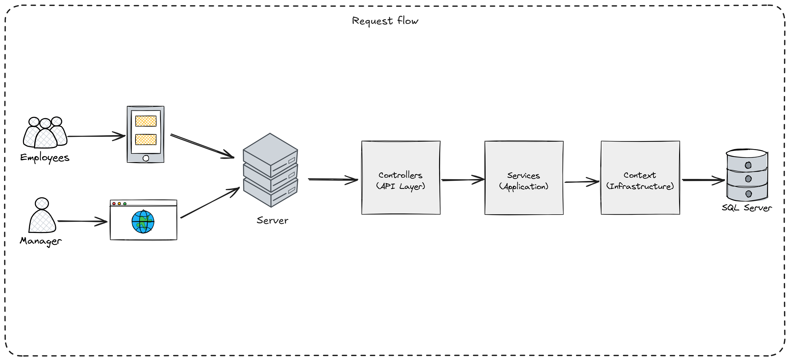

# System Architecture

This document describes the high-level architecture of our Government Vehicle Management System.  
It explains how the application layers are organized and how data flows between them.

---

## High-Level Overview

The system follows a layered (Clean) architecture:

1. **API Layer**  
   - ASP.NET Core controllers and SignalR hubs.  
   - Swagger/OpenAPI for documenting endpoints.  
   - Global exception handling middleware.

2. **Application Layer**  
   - Services, DTOs, and validators.  
   - Hangfire background jobs.  
   - Interfaces for Infrastructure implementations.

3. **Domain Layer**  
   - Core business entities (e.g., `Car`, `Driver`, `CheckPoint`) and logic.  
   - Domain services or rules that enforce invariants.

4. **Infrastructure Layer**  
   - EF Core DbContext, migrations, identity configuration.  
   - Integrations (e.g., email, SMS).  
   - Serilog setup or other cross-cutting concerns.

Below is a simple flowchart in Mermaid notation depicting how these layers communicate:

