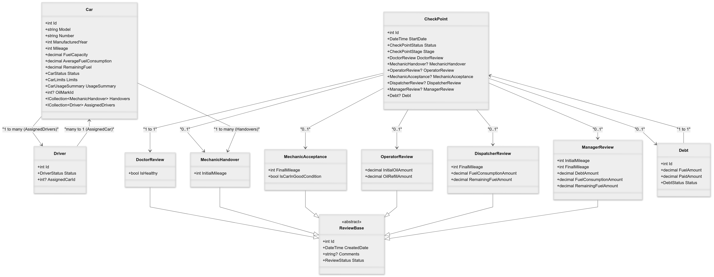

# Domain Model

This document provides an overview of the core entities and their relationships.  
Below is a Mermaid class diagram representing some of our main classes: `Car`, `Driver`, `CheckPoint`, and review entities like `DoctorReview`, `MechanicHandover`, etc.

---

## Mermaid Class Diagram
