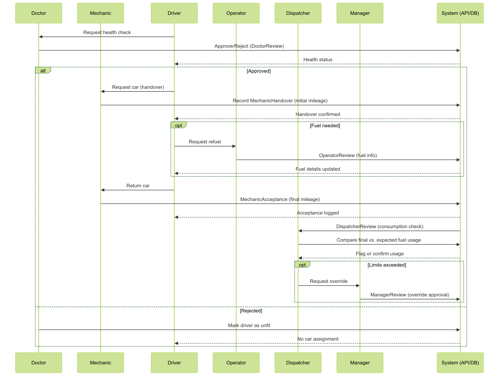

---

# 3. `docs/diagrams/workflow-diagrams.md` (or `use-case.md`)

```markdown

# Workflow Diagrams

This file contains sequence or flow diagrams illustrating the main processes (e.g., doctor approval, car handover, and final acceptance).

---

## Ride Workflow Sequence Diagram

